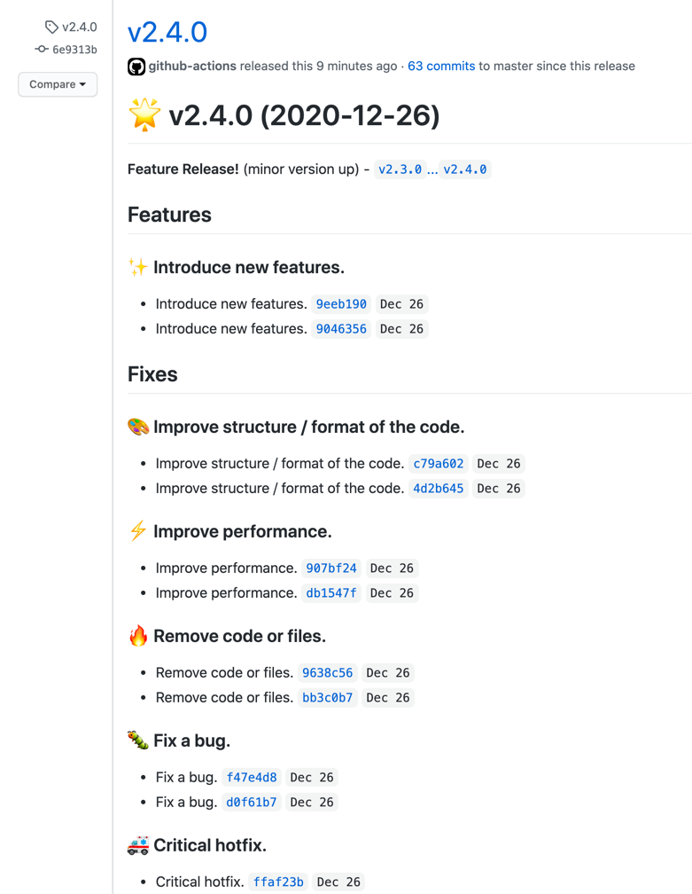
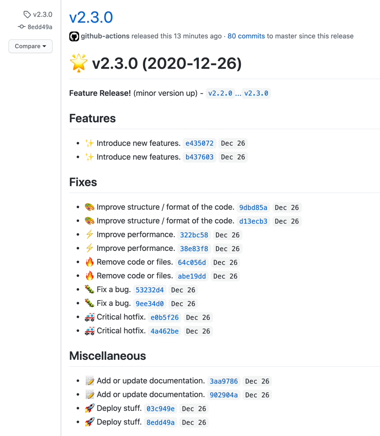
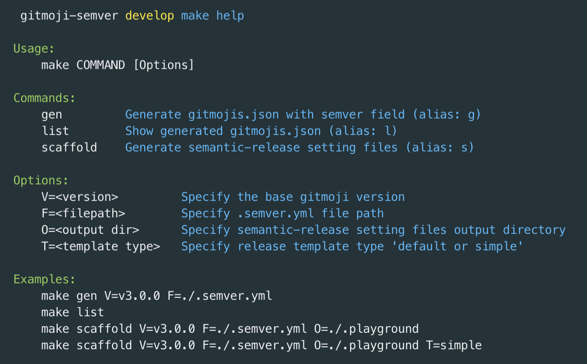

<h1 align="center">Welcome to gitmoji-semver 👋</h1>

<p align="center">
  <a href="#" target="_blank">
    
  </a>
  <a href="https://gitmoji.carloscuesta.me">
    
  </a>
  <a href="https://github.com/semantic-release/semantic-release">
    
  </a>
</p>


<!-- @import "[TOC]" {cmd="toc" depthFrom=1 depthTo=6 orderedList=false} -->

<!-- code_chunk_output -->

- [Features](#features)
  - [Release template type](#release-template-type)
- [How to use in Mac](#how-to-use-in-mac)
  - [Install](#install)
  - [Usage](#usage)
- [How to use in GithubActions ( only 3 minutes )](#how-to-use-in-githubactions--only-3-minutes-)
  - [Step 1: Add `.semver.yml` to your Repository root](#step-1-add-semveryml-to-your-repository-root)
  - [Step 2: Add `release.yml` to `.github/workflows/`](#step-2-add-releaseyml-to-githubworkflows)
  - [Step 3: Commit and Push](#step-3-commit-and-push)
    - [If you want to run locally](#if-you-want-to-run-locally)
- [References](#references)
- [Author](#author)
- [Show your support](#show-your-support)

<!-- /code_chunk_output -->

## Features

- :smile: A simple script to add the semver field
  to [gitmojis.json](https://github.com/carloscuesta/gitmoji/blob/master/src/data/gitmojis.json).
    - Generate the files `gitmojis.json` with the semver field added.
- :rocket: You can automatically and easily release by semver (semantic versioning) just by
  committing with Gitmoji. ( [like this](https://github.com/nkmr-jp/gitmoji-semver/releases) )
    - Automate versioning and release with GithubActions
      and [semantic-release](https://github.com/semantic-release/semantic-release).

### Release template type

| [default](https://github.com/nkmr-jp/gitmoji-semver-sample/releases/tag/v2.4.0) | [simple](https://github.com/nkmr-jp/gitmoji-semver-sample/releases/tag/v2.3.0) |
| ------------------------------------------------------------------------------- | ------------------------------------------------------------------------------ |
|                                                          |                                                         |

## How to use in Mac

### Install

Require `curl`, `jq`, `yq` and `node` command.

```sh
brew install curl yq jq

yq --version
# yq 2.10.1
jq --version
# jq-1.6
node --version
# v13.14.0 # Probably works in other versions too.

# Install
git clone https://github.com/nkmr-jp/gitmoji-semver
```

### Usage

```sh
cd ./gitmoji-semver
make help
```



## How to use in GithubActions ( only 3 minutes )

The following steps will automate versioning and releasing with gitmoji using GithubActions. You
only need to add two files, and you're ready to go. Feel free to try it out in your own Github
Repository.

### Step 1: Add `.semver.yml` to your Repository root

example: [./.semver.yml](.semver.yml)

```yml
# .semver.yml

# Release Branches
branches: [ master, main ]

# gitmoji semver settings (default is none)
semver:
  major:
    - boom      # Introduce breaking changes.
  minor:
    - sparkles  # Introduce new features.
  patch:
    - bug                   # Fix a bug.
    - ambulance             # Critical hotfix.
    - green_heart           # Fix CI Build.
    - construction_worker   # Add or update CI build system.
  none:
    - memo      # Add or update documentation.

  # Prevents it from appearing in Github's Release.
  ignore:
    - construction  # Work in progress.
```

### Step 2: Add `release.yml` to `.github/workflows/`

```yml
# .github/workflows/release.yml

name: Release
on:
  push:
    branches:
      - master
      - main
jobs:
  release:
    name: Release
    runs-on: ubuntu-18.04
    steps:
      - name: Checkout
        uses: actions/checkout@v2
        with:
          fetch-depth: 0
      - name: Setup Node.js
        uses: actions/setup-node@v1
        with:
          node-version: 12
      - name: Install jq yq
        run: |
          sudo wget https://github.com/stedolan/jq/releases/download/jq-1.6/jq-linux64 -O /usr/bin/jq &&\
          sudo chmod +x /usr/bin/jq
          sudo pip install yq
          jq --version
          yq --version
      - name: Install gitmoji-semver
        run: |
          git clone https://github.com/nkmr-jp/gitmoji-semver -b v1.6.0
      - name: Generate semantic-release configs
        working-directory: ./gitmoji-semver
        run: |
          make scaffold V=v3.0.0 F=../.semver.yml O=.. M=simple
      - name: Release
        working-directory: ./.release
        env:
          GITHUB_TOKEN: ${{ secrets.GITHUB_TOKEN }}
        run: |
          npm install
          npx semantic-release
```

### Step 3: Commit and Push

```sh
git add .
git commit -m ":construction_worker: Add Release settings by https://github.com/nkmr-jp/gitmoji-semver"
git push
```

:tada: Done! Check out the Release Page in your Github Repository.

#### If you want to run locally

There will not be an actual Release. You can see how it works.

```sh
brew install act
act -P ubuntu-18.04=nektos/act-environments-ubuntu:18.04 # ※ 16GB docker image
```

## References

- [Add a "semver" field for each emoji #429](https://github.com/carloscuesta/gitmoji/issues/429)
- [gitmoji | An emoji guide for your commit messages](https://gitmoji.carloscuesta.me/)
- [GitHub - semantic-release/semantic-release](https://github.com/semantic-release/semantic-release)
- [GitHub - momocow/semantic-release-gitmoji](https://github.com/momocow/semantic-release-gitmoji)
- [Semantic Versioning 2.0.0 | Semantic Versioning](https://semver.org/)
- [Introduction to SemVer](https://blog.greenkeeper.io/introduction-to-semver-d272990c44f2)

## Author

👤 **nkmr-jp**

## Show your support

Give a ⭐️ if this project helped you!

***
_This README was generated with ❤️
by [readme-md-generator](https://github.com/kefranabg/readme-md-generator)_
